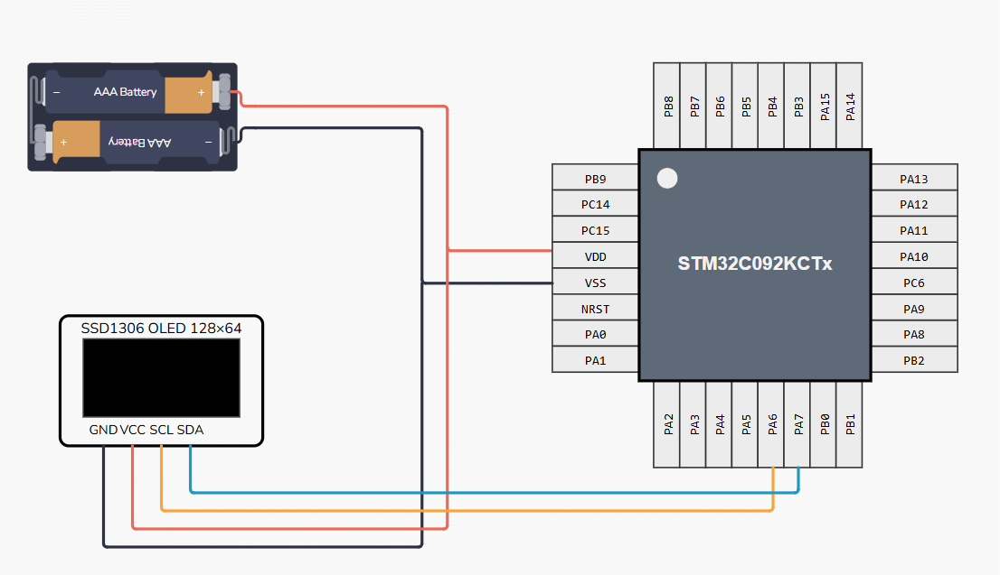

# STM32 を使った SSD1306 接続例

STM32C092KCT6 から OLED ディスプレイ SSD1306 に接続する例です。

[C STM32CubeIDE プロジェクト](c-project)と [Rust Embassy プロジェクト](rust-project)が含まれています。

以下の配線で I2C2 から制御します。



SWD プログラマでプログラミング確認しました。ピン接続は以下の通りです。

| デバイス  | プログラマ |
| --------- | ---------- |
| PA13 (24) | SWDIO      |
| PA14 (25) | SWCLK      |
| NRST (6)  | RST        |

馬のアニメーションは ControllersTech のチュートリアルで配布されているものを使いました。
https://controllerstech.com/oled-display-using-i2c-stm32/

## C STM32CubeIDE プロジェクト
一から設定する手順は[ブログ記事](https://gaje.jp/2026/01/07/8167/)をご参考にどうそ。

プロジェクトをビルドするには、ライブラリ stm32-ssd1306 が必要です。

https://github.com/afiskon/stm32-ssd1306

このリポジトリをチェックアウトした後、以下のコマンドを実行するとライブラリがチェックアウトされます。

```
git submodule update --init --recursive
```

## Rust Embassy プロジェクト
`rust-project` ディレクトリに移動し、プログラマをつなげた後以下を実行すれば動作します。

```
cargo build --release
cargo run --release
```

内容については、[ブログ記事](https://gaje.jp/2026/01/10/8218/)も参考にしてみてください。

